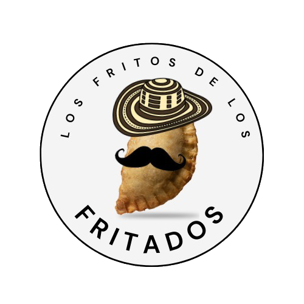
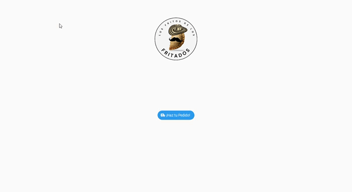
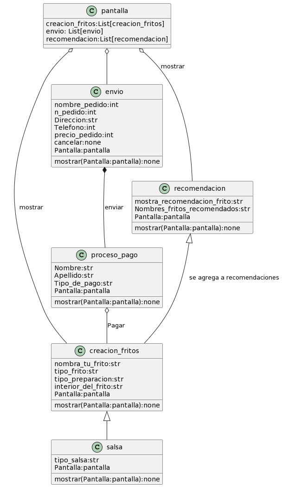

<div align="center">



[](https://www.python.org/downloads/release/python-3912/)

# ¡Frito de los Frita2!

**Autores:**
- Rubens Apresa Echeverría
- Santiago Romero Martínez

</div>

---

## Descripción

**¡Frito de los Frita2!** es una aplicación diseñada para ofrecer una manera innovadora y creativa de personalizar y pedir fritos a tu gusto. El objetivo del proyecto es explorar las capacidades de **Kivy** en Python para crear aplicaciones interactivas.

---

## Características de la Aplicación

- Personalización total de tu pedido de fritos.
- Interfaz creativa y fácil de usar.
- Ideal para aprender sobre **Kivy** y prototipado rápido en Python.

---

## Ejemplo en Acción

<div align="center">

</div>

---

## Diagrama UML

El siguiente diagrama UML representa la estructura básica de la aplicación:

<div align="center">

</div>

---

## ¿Quieres Probarla?

Escanea el siguiente código QR para acceder a nuestra aplicación:

<div align="center">

</div>

---

## Notas del Proyecto

Este proyecto fue desarrollado con fines educativos para explorar **Kivy**, una tecnología de Python para el desarrollo de interfaces gráficas. Por lo tanto:

- **No está optimizado para producción**: Es un prototipo diseñado para aprender y experimentar.
- **Posibles mejoras futuras**: Implementación de funciones avanzadas y optimización para uso real.

---

## Requisitos

Asegúrate de tener instalado lo siguiente para ejecutar la aplicación:

- **Python 3.9.12 o superior**
- Librerías necesarias (instaladas mediante `pip`):

  ```bash
  pip install kivy
  ```

---

## Instalación y Uso

1. Clona este repositorio:

   ```bash
   git clone https://github.com/tu_usuario/FritoDeLosFrita2.git
   ```

2. Navega al directorio del proyecto:

   ```bash
   cd FritoDeLosFrita2
   ```

3. Instala las dependencias necesarias:

   ```bash
   pip install -r requirements.txt
   ```

4. Ejecuta la aplicación:

   ```bash
   python main.py
   ```

---


