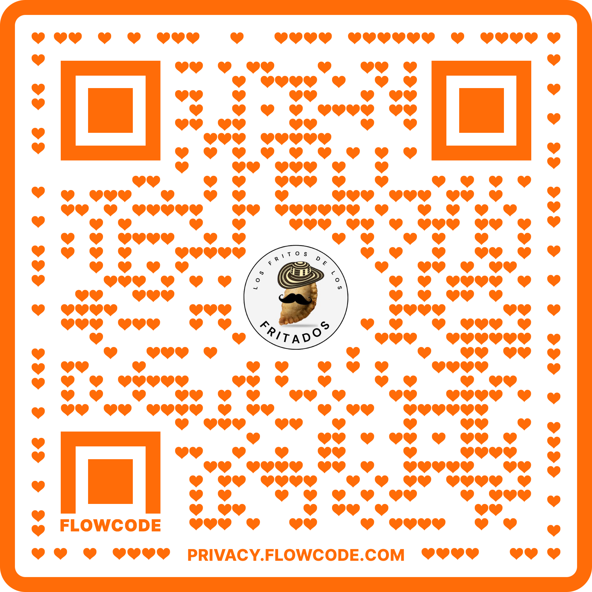

  
   

     
   
 
  
  
  
  # ¡Frito de los Frita2!
  Rubens Apresa Echeverria
  Santiago Romero Martinez
  

 

## Que te ofrece nuestra App de fritos
Nuestra aplicacion ofrece una manera diferente de pedir tu frito de una manera muy creativa
asi podras pedir tu frito a tu gusto como quieres sin problemas

# Nuestro Diagrama UML

  
 
 

# ¿Quieres probarla?

 

